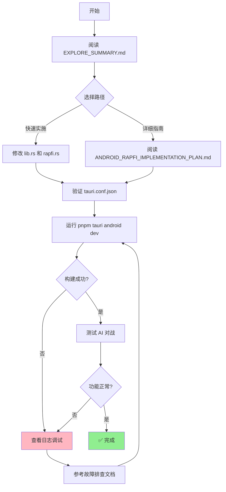

# Android Rapfi 集成 - 文件清单

## 📋 完整文件列表

### ✅ 新创建的文件 (7个)

| 文件路径 | 类型 | 说明 | 状态 |
|---------|------|------|------|
| `src-tauri/src/android_rapfi.rs` | 代码 | Android 二进制提取模块 | ✅ 已创建 |
| `docs/ANDROID_RAPFI_IMPLEMENTATION_PLAN.md` | 文档 | 详细实施步骤 (9个步骤) | ✅ 已创建 |
| `docs/ANDROID_RAPFI_BUILD.md` | 文档 | 从源码构建 rapfi 指南 | ✅ 已创建 |
| `docs/ANDROID_RAPFI_ARCHITECTURE.md` | 文档 | 系统架构和数据流图 | ✅ 已创建 |
| `scripts/build-android-rapfi.sh` | 脚本 | 自动构建 Android rapfi | ✅ 已创建 |
| `scripts/setup-rapfi-submodule.sh` | 脚本 | 添加 rapfi 作为 submodule | ✅ 已创建 |
| `EXPLORE_SUMMARY.md` | 文档 | 探索总结和快速开始 | ✅ 已创建 |

### 🔧 需要修改的文件 (2个)

| 文件路径 | 修改内容 | 行数变化 | 状态 |
|---------|---------|---------|------|
| `src-tauri/src/lib.rs` | 添加 `mod android_rapfi;` | +1 | ⚠️ 待修改 |
| `src-tauri/src/rapfi.rs` | 在 `get_engine_path()` 添加 Android 处理 | ~+15 | ⚠️ 待修改 |

### ✅ 需要验证的文件 (1个)

| 文件路径 | 验证内容 | 预期结果 | 状态 |
|---------|---------|---------|------|
| `src-tauri/tauri.conf.json` | `bundle.resources` 包含 rapfi 二进制 | 有 `"binaries/rapfi-*-linux-android"` | ⚠️ 待验证 |

### ✅ 已存在的文件 (无需修改)

| 文件路径 | 说明 | 大小 |
|---------|------|------|
| `src-tauri/binaries/rapfi-aarch64-linux-android` | ARM64 版本 (真机) | 24MB |
| `src-tauri/binaries/rapfi-x86_64-linux-android` | x86_64 版本 (模拟器) | 24MB |
| `src-tauri/binaries/config.toml` | rapfi 配置 | 6.7KB |
| `src-tauri/binaries/mix9svqfreestyle_bsmix.bin.lz4` | 自由模式权重 | ~10MB |
| `src-tauri/binaries/mix9svqstandard_bs15.bin.lz4` | 标准模式权重 | ~10MB |
| `src-tauri/binaries/mix9svqrenju_bs15_black.bin.lz4` | Renju 黑棋权重 | ~9.5MB |
| `src-tauri/binaries/mix9svqrenju_bs15_white.bin.lz4` | Renju 白棋权重 | ~9.4MB |

---

## 📝 详细修改说明

### 修改 1: `src-tauri/src/lib.rs`

**位置**: 文件顶部，模块声明区域

**添加内容**:
```rust
mod android_rapfi;  // Android rapfi 二进制提取

mod rapfi;
// ... 其他现有模块
```

**影响**: 无副作用，仅添加模块声明

---

### 修改 2: `src-tauri/src/rapfi.rs`

**位置**: `get_engine_path()` 函数开头

**添加内容**:
```rust
fn get_engine_path<R: tauri::Runtime>(app: &tauri::AppHandle<R>) -> Result<PathBuf, String> {
    // ===== Android 平台特殊处理 =====
    #[cfg(target_os = "android")]
    {
        use std::env;
        
        eprintln!("🤖 [Android] Detected Android platform");
        
        // 尝试从 assets 提取 rapfi
        match crate::android_rapfi::extract_rapfi_binary(app) {
            Ok(path) => {
                eprintln!("✅ [Android] Using extracted rapfi: {}", path.display());
                return Ok(path);
            }
            Err(e) => {
                eprintln!("❌ [Android] Failed to extract rapfi: {}", e);
                // 继续尝试其他路径...
            }
        }
    }
    // ===================================

    // 原有的桌面平台逻辑保持不变
    if let Ok(path) = app.path().resolve("rapfi", BaseDirectory::Resource) {
        // ... (现有代码)
    }
    // ... (其余现有代码)
}
```

**影响**: 
- 仅在 Android 平台生效 (`#[cfg(target_os = "android")]`)
- 桌面平台行为完全不变
- 如果提取失败，会继续尝试其他路径（向后兼容）

---

### 验证: `src-tauri/tauri.conf.json`

**检查内容**: `bundle.resources` 数组

**预期配置**:
```json
{
  "bundle": {
    "resources": [
      "binaries/config.toml",
      "binaries/*.bin.lz4",
      "binaries/rapfi-*-linux-android"  // ← 确保存在
    ],
    "externalBin": [
      "binaries/rapfi"
    ]
  }
}
```

**如果缺失**: 添加 `"binaries/rapfi-*-linux-android"` 到 resources 数组

---

## 🔄 实施工作流



---

## 📊 修改影响评估

| 修改 | 风险等级 | 影响范围 | 回滚难度 |
|------|---------|---------|---------|
| `lib.rs` 添加模块 | 🟢 低 | 仅编译时 | 极易 (删除一行) |
| `rapfi.rs` 添加 Android 逻辑 | 🟢 低 | 仅 Android 平台 | 极易 (删除代码块) |
| `tauri.conf.json` 验证配置 | 🟢 低 | 资源打包 | 极易 (删除一行) |

**总体风险**: 🟢 **极低** - 所有修改都是增量式的，不影响现有功能

---

## ✅ 完成标准

集成成功的标志:

- [ ] `pnpm tauri android dev` 构建成功
- [ ] 日志显示 `✅ [Android] rapfi extracted successfully`
- [ ] 日志显示 `✅ [AI] Engine spawned successfully`
- [ ] AI 能够正确响应落子
- [ ] 三个难度级别都正常工作
- [ ] 响应时间符合预期 (<3s)

---

## 📞 获取帮助

| 问题类型 | 参考文档 | 位置 |
|---------|---------|------|
| 不知从何开始 | `EXPLORE_SUMMARY.md` | 项目根目录 |
| 需要详细步骤 | `ANDROID_RAPFI_IMPLEMENTATION_PLAN.md` | docs/ |
| 构建问题 | `ANDROID_RAPFI_BUILD.md` | docs/ |
| 架构不理解 | `ANDROID_RAPFI_ARCHITECTURE.md` | docs/ |
| 具体错误排查 | `ANDROID_RAPFI_IMPLEMENTATION_PLAN.md` | docs/ → 🔍 调试指南 |

---

## 🎯 预计时间

| 阶段 | 预计时间 | 实际时间 |
|------|---------|---------|
| 阅读文档 | 10 分钟 | _____ |
| 修改代码 | 15 分钟 | _____ |
| 测试构建 | 10 分钟 | _____ |
| 功能验证 | 10 分钟 | _____ |
| 问题调试 (可选) | 30 分钟 | _____ |
| **总计** | **~1 小时** | _____ |

---

**检查清单版本**: 1.0  
**创建日期**: 2026-03-28  
**最后更新**: 2026-03-28
